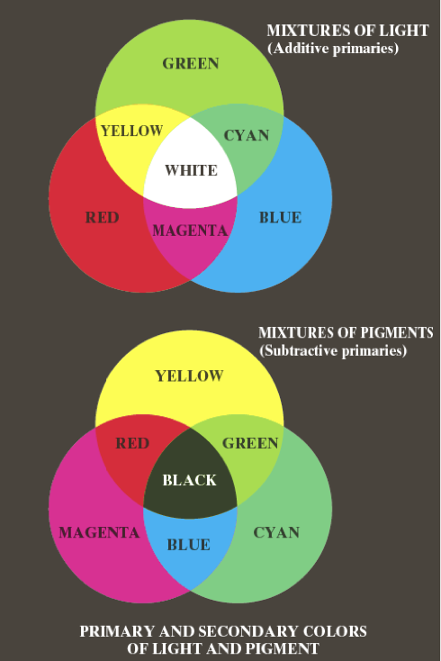
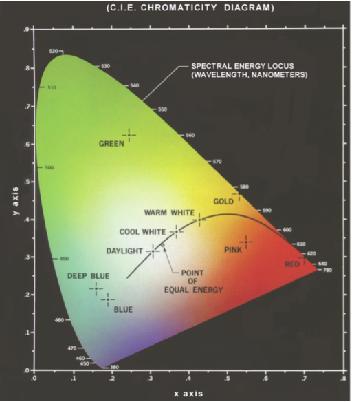
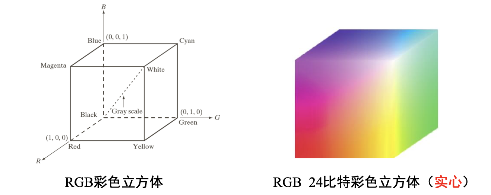
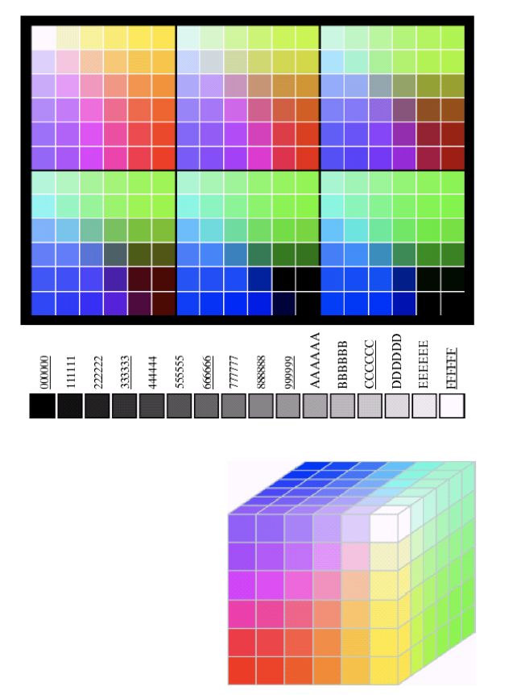
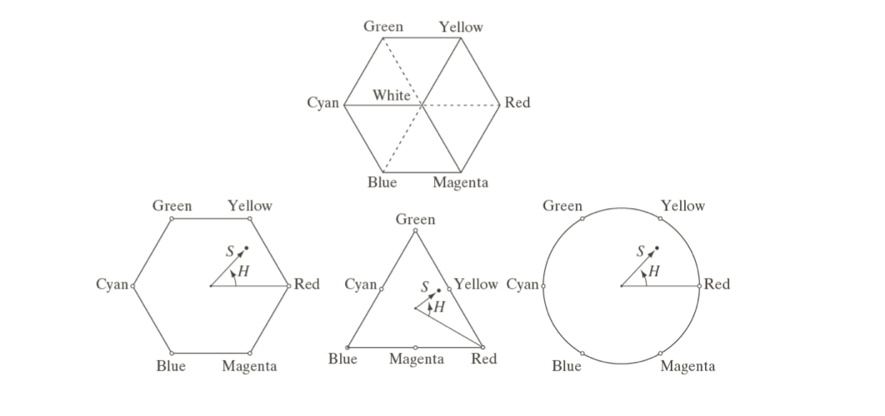
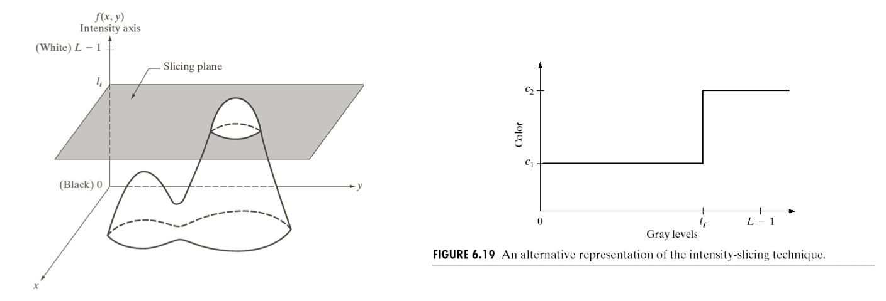
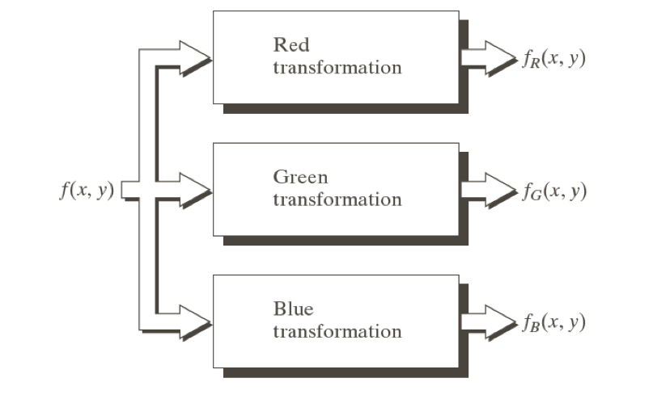
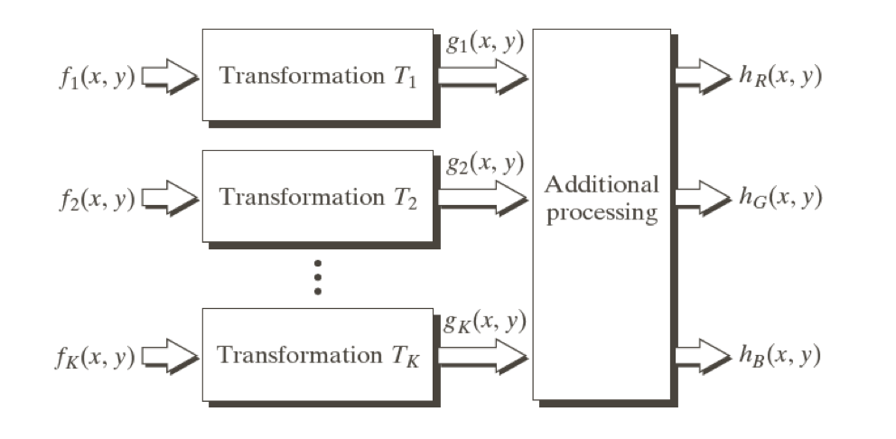

# 彩色图像处理
## 彩色基础
* 人类感知一个物体的颜色是由物体反射光的性质决定的
* 描述彩色光源的基本量：
    * 辐射：是从光源流出能量的总量，用瓦特来度量
    * 光强：给出观察者从光源感知的能量总和的度量，用流明来度量
    * 亮度：是主观描绘子，不可度量，体现了无色的强度的概念
* 三原色：蓝色 = 435.8nm，绿色 = 546.1nm，红色 = 700nm
    * 错误概念：三原色以各种强度比混合在一起时，就可以产生所有的可见彩
    * 原色相加可以产生二次色
    * 区别光的原色和颜料的原色：
        * 颜料的三原色为 MCY ，满足减色原理，混合后为黑色
        * 光的三原色为 RGB ，满足加色原理，混合后为白色
        

* 区别不同颜色特性的特征：
    * 亮度：Intensity，表达无色的强度概念
    * 色调：Hue，是光波混合中与主波长有关的属性，表示观察者感知的主要颜色
    * 饱和度：Saturation，指相对的纯净度，或一种颜色混合白光的数量（饱和度与白光数量成反比）
    * 色调和饱和度一起成为色度，形成任何特殊彩色的红、绿、蓝的数量称为三色值
    * CIE 色度图：以红和绿的函数表示颜色的组成
        * 等能量点表示白光的 CIE 标准
        * 色度图边界上的点为全饱和颜色
        * 色度图中连接任意两点的直线段定义了所有不同颜色的变化，这些颜色可以由这两种颜色相加组合得到

---

## 彩色模型
目的：在某些标准下用通常可以接受的方式方便地对彩色加以说明
* RGB 彩色模型
    

    * 面向硬件，常用于彩色摄像机
    * 在 RGB 彩色模型中表示的图像由3个分量图像组成，每种原色一幅分量图像
    * 像素深度：用于表示每个像素的比特数
    * 稳定色：与观察者无关，共216种，每种都由3个十六进制数构成，如 FFFFFF 为白色，000000 为黑色

* CMY 和 CMYK 彩色模型
    * 青色、深红色、黄色是光的二次色，是颜料的原色
    * 大多数在纸上沉积彩色颜料的设备，如彩色打印机和复印机，要求输入 CMY 数据或在内部进行 RGB 到 CMY 的转换
    * RGB -> CMY： $\left[\begin{array}{rcl}C\\M\\Y\end{array} \right]=\left[\begin{array}{rcl}1\\1\\1\end{array} \right]-\left[\begin{array}{rcl}R\\G\\B\end{array} \right]$
    * CMYK 模型加上了黑色
* HSI 彩色模型
    * 更符合人描述和解释颜色的方式
    * 形成 HSI 空间所要求的色调、饱和度和强度值可以通过 RGB 彩色立方体得到，也就是说可以将任何 RGB 点转换为对应 HSI 彩色模型中的点
    * 与红轴的夹角给出了色调，向量的长度是饱和度，强度由垂直强度轴上的平面的位置决定
    

    * RGB -> HSI：
        * $H= \left\{\begin{array}{rcl}\theta, & & B\leq G\\360-G,&  & B\geq G\end{array}\right.$  
          其中，$\theta=arccos\{\frac{\frac{1}{2}[(R-G)+(R-B)]}{[(R-G)^2+(R-B)(G-B)]^{1/2}}\}$
        * $S=1-\frac{3}{(R+G+B)}[minR,G,B)]$
        * $I=\frac{1}{3}(R+G+B)$
    * HSI -> RGB：
        * 若在 RG 扇区内（$0^\circ\leq H<120^\circ$）  
              $\begin{array}{l}B=I(1-S)\\R=I[1+\frac{ScosH}{cos(60^\circ-H)}]\\G=3I-(R+B)\end{array}$  
        * 若在 GB 扇区内（$120^\circ\leq H<240^\circ$）  
              $\begin{array}{l}H=H-120^\circ\\R=I(1-S)\\G=I[1+\frac{ScosH}{cos(60^\circ-H)}]\\B=3I-(R+B)\end{array}$  
        * 若在 RB 扇区内（$240^\circ\leq H<360^\circ$）  
              $\begin{array}{l}H=H-240^\circ\\G=I(1-S)\\B=I[1+\frac{ScosH}{cos(60^\circ-H)}]\\R=3I-(R+B)\end{array}$
* HSV 模型
    * 一般用六棱锥表示
    * H 同 HSI 模型
    * RGB -> HSV：  
        $\begin{array}{l}S=\frac{max(R,G,B)-min(R,G,B)}{max(R+G+B)}\\V=\frac{max(R,G,B)}{255}\end{array}$

---

## 伪彩色图像处理
伪彩色图像处理是指基于一种指定的规则对灰度值赋以颜色的处理
* 灰度分层
    

    * 用一些平行于图像的坐标平面的平面来切割图像，对被切割的不同部分赋以不同的颜色
* 灰度到彩色的变换
    

    * 对任何输入的像素灰度执行三个独立的变换，将三个变换结果分别送入彩色监视器的红、绿、蓝通道，产生一副合成图像
    * 多光谱图像处理

---

## 全彩色图像处理
* 第一种方法是将彩色图像看作三幅分量图像的组合体，县分别单独处理，再将结果合成
* 第二种方法是将彩色图像中的每个像素看作一个向量，用对向量的表达方法进行处理* 两种方法等价的条件
    * 处理必须对向量和标量都可用
    * 对向量的每个分量的操作对其他分量必须是独立的

---

## 彩色变换

