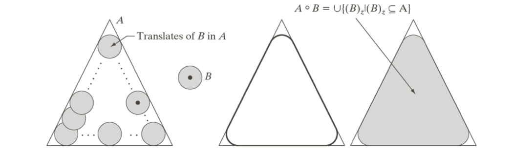
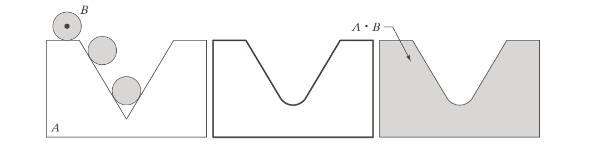
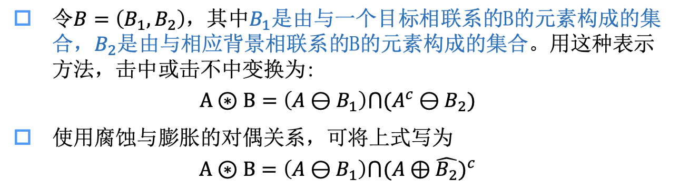

# 形态图像处理
## 预备知识
* 反射、平移
* 结构元
## 腐蚀和膨胀
* 腐蚀
    * 将 B 平移，当其原点位于 z 时，其包含在 A 中，则 z 为一个有效的位置，所有有效的z构成了腐蚀之后的结果
    * 腐蚀缩小或细化了二值图像中的物体
    * 可以将腐蚀看作形态学滤波操作，这种操作把比结构元小的图像细节从图像中滤除
* 膨胀
    * 将 B 关于原点映像之后，再平移，当其原点平移到 z 时，如果其与 A 有重叠元素，则 z 为一个有效的位置，所有有效的 z 构成了膨胀之后的结果
    * 腐蚀是一种收缩或细化操作，而膨胀则会“增长”或“粗化”二值图像中的物体
    * 膨胀、腐蚀都是非线性操作
* 对偶性
    * $B$ 对 $A$ 的腐蚀是 $\hat{B}$ 对 $A^c$ 的膨胀的补集，反之亦然
    *  当结构元关于其原点对称时有 $\hat{B}=B$，此时可以用相同
的结构元简单地使用 $B$ 膨胀图像的背景，对该结果求补即可得到 $B$ 对该幅图像的腐蚀

## 开操作与闭操作
* 开操作一般会平滑物体的轮廓、断开较窄的狭颈并消除较细的突出物
* 闭操作同样也会平滑轮廓的一部分，但与开操作相反，它通常会弥合较窄的间断和细长的沟壑，消除较小的孔洞，填补轮廓线中的断裂
* B 对 A 的开操作就是 B 对 A 的腐蚀，紧接着用 B 对结果进行膨胀
* B 对集合 A 的闭操作就是用 B 对 A 膨胀，再用 B 对结果腐蚀
* 几何解释
    * 假设我们把结构元 B 视为一个“转球”
    * B 对 A 的开操作的边界由 B 中的点建立：当 B 在 A 的边界内侧滚动时，B 所能到达的 A 的边界的最远点

    

    * 开操作与闭操作彼此对偶，所以闭操作在边界外侧滚动球体是意料之中的事情，B 在 A 的边界外侧外切滚动一圈， 所有 $(B)_z$ 的并集构成的内包络为边界
    

    * 类似于膨胀和腐蚀，开操作和闭操作彼此关于集合求补和反射也是对偶的
    * 注意：算子应用一次后，一个集合的多次开操作或闭操作没有影响
## 击中或击不中变换

* 使用与物体有关的结构元 $B_1$ 和与背景有关的结构元 $B_2$ 的原因，基于一个假设的定义——仅当两个或多个物体形成相脱离的集合时，这些物体才是可分的
* 击中-击不中运算常用于二值图像，它用于基于结构元素的配置，从图像中寻找具有某种像素排列特征的目标，如单个像素、颗粒中交叉或纵向的特征、直角边缘或其他用户自定义的特征等。计算时，只有当结构元素与其覆盖的图像区域完全相同时，中心像素的值才会被置为1，否则为0
## 基本的形态学算法
* 边界提取
    * 表示为 $\beta (A)$ 的集合 A 的边界可以通过先用 B 对 A 腐蚀，而后执行 A 和腐蚀的结果之间的差集得到
* 孔洞填充
    * 孔洞定义:由前景像素相连接的边界所包围的背景区域
    * 令 A 表示一个集合，其元素是 8 连通的边界，每个边界包围一个背景区域。当给定每个孔洞中的一个点后，目的就是用 1 填充所有的 孔洞
    * 给定每个孔洞中对应于 $X_0$ 中的位置点(这一点已经置为 1 )，我们从形成一个由 0 组成的阵列 $X_0$ 开始。然后，如下过程将用 1 填充所有孔洞L ：$X_k=(X_{k-1}\oplus B)\cap A^c$
    * 如果 $X_k = X_{k-1}$ ，则算法在迭代的第 k 步结束。然后，集合 $X_k$ 包含所有被填充的孔洞。$X_k$ 和 A 的并集包含所有填充的孔洞及这些孔洞的边界
    * 如果左边不加限制，那么膨胀将填充整个区域。然而，每一步中 与 $A^c$ 的交集操作将把结果限制到感兴趣区域内，称为条件膨胀
* 连通分量的提取
    * 令 A 是包含一个或多个连通分量的集合，并形成一个阵列 $X_0$ 除了在对应于 A 中每个连通分量的一个点的每个已知位置处我们已置为 1 外，该阵列的所有其他元素均为 0 。如下迭代过程可完成这一目 的：$X_k=(X_{k-1}\oplus B)\cap A$
* 凸壳
    * 如果在集合 A 内连接任意两个点的直线段都在 A 的内部，则称集合 A 是凸形的。任意集合 S 的凸壳 H 是包含 S 的最小凸集。差集 H-S 称为 S 的凸缺
    * $X^i_k=(X_{k-1}\circledast B^i)\cup A$，当该过程收敛时，我们令 $D^i=X^i_k$，则 A 的凸壳为：$C(A)=\bigcup^4_{i=1}D^i$ 
* 细化
    * $A\otimes B=A-(A\circledast B)$
    * 我们仅对与结构元的模式匹配感兴趣，所以在击中或击不中变换中没有背景运算
* 粗化
    * 粗化是细化的形态学对偶：$A\cdot B=A\cup (A\circledast B)$
    * 然而，针对粗化的分离算法在实际中很少用到，取而代之的过程 是先对问题中集合的背景进行细化，而后对结果求补集。由于依赖于 A 的性质，这个过程可能会产生某些断点。因此，通过这种方法的粗化处理通常会跟随一个消除断点的后处理
* 骨架
    * A 的骨架可以用腐蚀和开操作来表达，即骨架可以表示为 $S(A)=\bigcup^K_{k=0}S_k(A)$ 其中，$S(A)=(A\ominus kB)-(A\ominus kB)\circ B$， $K$ 是 A 被腐蚀成空集前的最后一次迭代步骤
    * 使用下式可由这些子集来重建 A ：$A=\bigcup^K_{k=0}(S_k(A)\oplus kB)$ 
* 裁剪
    * 裁剪方法本质上是对细化和骨架算法的补充，因
    * 为这些过程会保留某些寄生成分，因而需要用后处理来清除这些寄生成分
* 形态学重建
    * 形态学重建涉及两幅图像和一个结构元，一幅图像是标记，它包含变换的起始点，另一幅图像是模板，它用来约束该变换。结构元用来定义连续性
    * 形态学重建的核心是测地膨胀和测地腐蚀
        * 测地膨胀和测地腐蚀关于集合的补集对偶
        * 有限数量图像的测地膨胀和腐蚀经过有限数量的迭代步骤后总会收敛，因为标记图像的扩散或收缩受模版约束
    * 用腐蚀和膨胀的形态学重建：反复执行测地膨胀或腐蚀，直到达到稳定状态
    * 重建开操作：形态学开操作中，腐蚀会删除小的物体，而后续的膨胀会试图恢复遗留物体的形状。然而这种恢复的准确性高度依赖于物体的形状和所用结构元的相似性；而重建开操作可正确地恢复腐蚀后所保留物体的形状
    * 填充孔洞
    * 边界清除
## 灰度级形态学
* 腐蚀与膨胀
    * 当 b 的原点位于 (𝑥,𝑦) 处时，用一个平坦的结构元 b 在 (𝑥,𝑦) 处对图像 𝑓 的腐蚀定义为图像 𝑓 中与 b 重合区域的最小值
    * 类似地，当 b 的原点位于位置 (𝑥,𝑦) 处时，平坦结构元 b 在任何位置 (𝑥, 𝑦) 处对图像 𝑓 的膨胀定义为图像 𝑓 中与 b 重合区域的最大值
* 开操作和闭操作
    * 灰度级图像的开操作和闭操作的表达式，与二值图像的对应操作 具有相同的形式
    * 开操作用于去除较小的明亮细节，而保持整体灰度级和较大的明亮特征相对不变；闭操作抑制暗细节
    * 开操作使得所有亮特征的灰度都降低了，降低的程度取决于这些特征相对于结构元的尺寸
    * 闭操作对于亮细节和背景相对来说未受影响，但削弱了暗特征，削弱的程度取决于 这些特征相对于结构元的尺寸
* 灰度级形态学算法
    * 形态学平滑：因为开操作抑制比结构元小的亮细节，而闭操作抑制暗细节，所以它们常常以形态滤波的形式结合起来平滑图像和去除噪声
    * 形态学梯度：膨胀粗化一幅图像中的区域，而腐蚀则细化它们。膨胀和腐蚀之差强调区域间的边界。同质区域不受影响，因此相减操作趋于消除同质区域。最终结果是边缘被增强而同质区域的贡献则被抑制的图像，因此产生了“类似于微分”效果
    * 顶帽变换和底帽变换：用一个结构元通过开操作或闭操作从一幅图像中删除物体;然后，差操作得到一幅仅保留已删 除分量的图像。顶帽变换用于暗背景上的亮物体，而底帽变换则用于相反的情 况。由于这一原因，这些变换又称为白顶帽变换和黑底帽变换。顶帽变换的一个重要用途是校正不均匀光照的影响
    * 粒度测定
    * 纹理分割
* 灰度级形态学重建
